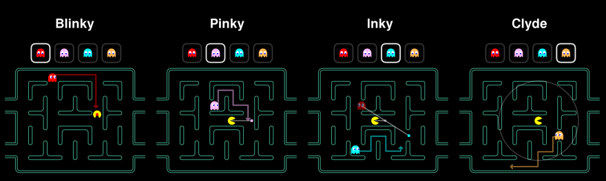

# Pacman


This is a modern recreation of the classic Pacman arcade game, developed to demonstrate my skills in game design, logic implementation, and user input. The project features smooth player controls, enemy AI behavior, collision detection, and a responsive interface. Built using Python, it captures the core mechanics of the original code.

## Maze Ghost AI Behaviors



- **Blinky**: Follows Pacman directly
- **Pinky**: Chases towards the spot 2 dots in front of Pacman
- **Inky**: His target is relative to both Blinky and Pacman, where the distance Blinky is fomr PInky's target is doubled to get Inky's target
- **Cylde**: Chases directly after Pacman if oustide 8-Dot radius. Otherwise moves towards the bottom left corner of the map.

## Installation instructions
### Step 1: Get the code
```bash
git clone https://github.com/Christian-estes/Pacman.git
cd Pacman
```

### Step 2: Set up a Virtual Enviorment (Recomended)
```bash
# Create a virtual enviorment
python -m venv venv

# Activate the virtual enviorment
# On Windows:
venv\Scripts\activate

# On Mac
source venv/bin/activate
```

### Step 3: Install Requirements
```bash
pip install -r requirements.txt
```

# Step 4: Run the game
```
python main.py
```


#### Controls
- Press 'SPACE' to start the game
- Use arrow keys to control Pacman
